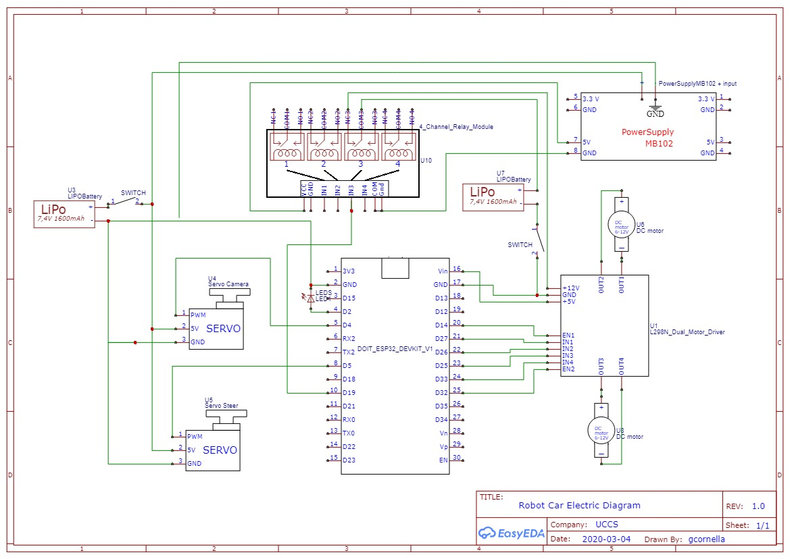

# WIFI Robot Controlled Through Xbox Controller
 
In this files you will find the C# code that we have created to control an RC car through an ESP32/ESP8266 Wi-Fi module.

We used Visual Basic as our design interface and we created a Windows Forms App where you can send commands to the robot. To communicate the PC to our robot, we are using the Arduino Wi-Fi module ESP8266, and connecting both of them using a UDP protocol. To control the robot we use the Xbox Controller.

  

  

The same C# program includes a box where you will be able to see in Live Stream the video send by a camera of your choice (we are using a smartphone with the App "IP webcam". You can take a snapshot or even record a video and the files will be saved in your PC. There are some camera controls because the camera is mounted on a support with a Servo, so that you can tilt the camera. A slider will allow you to move the camera separately from the robot commands.

  

/

For any further specifications, you can open the code and look at it because it's well commented.

###### University of Colorado at Colorado Springs
###### EUDALD SANGENIS & GUILLEM CORNELLA
